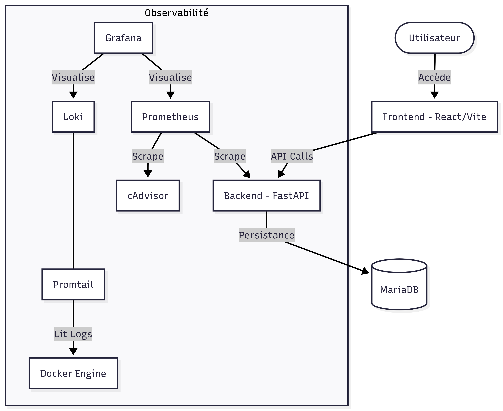

# Smart Campus - Gestion Intelligente du Campus

Ce projet est une plateforme numérique permettant d'optimiser l'utilisation des infrastructures universitaires. Il intègre la réservation de salles, la gestion d'incidents et le monitoring en temps réel de capteurs (occupation, température, consommation).

## 🏗 Architecture des Services

L'application repose sur une architecture conteneurisée et modulaire :



## 📋 Prérequis

Avant de commencer, assurez-vous d'avoir installé :
- [Docker](https://docs.docker.com/get-docker/)
- [Docker Compose](https://docs.docker.com/compose/install/)
- [Git](https://git-scm.com/)

## 🚀 Installation et Lancement

1. **Cloner le projet** :
   ```bash
   git clone https://github.com/Gramiz/Smart-Campus-Projet-1-DevOps.git
   cd Smart-Campus-Projet-1-DevOps
   ```
   ou
   ```bash
   git clone git@github.com:Gramiz/Smart-Campus-Projet-1-DevOps.git
   cd Smart-Campus-Projet-1-DevOps
   ```

2. **Configurer l'environnement** :
   Copiez le fichier d'exemple et remplissez-le avec vos configurations :
   ```bash
   cp .env.example .env
   ```
   Ouvrez ensuite le fichier `.env` pour y renseigner vos variables d'environnement.

3. **Lancer l'ensemble des services** :
   ```bash
   docker compose up -d
   ```

4. **Vérifier l'état des conteneurs** :
   ```bash
   docker compose ps
   ```

## 🌐 Adresses des Services

Une fois lancé, vous pouvez accéder aux différents services via les adresses suivantes :

| Service | URL | Description |
| :--- | :--- | :--- |
| **Frontend** | [http://localhost:5173](http://localhost:5173) | Interface utilisateur |
| **API Backend** | [http://localhost:8080](http://localhost:8080) | Point d'entrée de l'API |
| **Documentation API** | [http://localhost:8080/docs](http://localhost:8080/docs) | Swagger UI |
| **Grafana** | [http://localhost:3000](http://localhost:3000) | Dashboards de monitoring |
| **Prometheus** | [http://localhost:9090](http://localhost:9090) | Base de données de métriques |
| **cAdvisor** | [http://localhost:8081](http://localhost:8081) | Métriques des conteneurs en temps réel (CPU, RAM) |

## 📊 SRE & Observabilité

Le projet suit une démarche **SRE (Site Reliability Engineering)** avec des indicateurs de fiabilité définis :

- **SLIs mis en place** : Disponibilité API, Latence des réservations, Fraîcheur des données capteurs.
- **Dashboard Grafana** : Un tableau de bord "Advanced Smart Campus Monitoring" est pré-configuré pour visualiser ces indicateurs ainsi que les logs centralisés (Loki).

---
*Projet réalisé dans le cadre du Master Informatique - Università di Corsica - Année 2025/2026.*